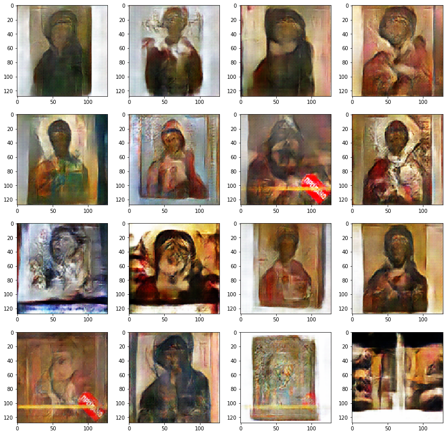

# Ikon-GAN

#### TL;DR

So, basically I wanted to create my own progressively improved API
for GAN experiments. In a current state project allows to:

- train GANs with custom network parameters
- output mid-training images and create cute gifs from them
- save/load trained models
- generate images using previously trained generators

Note: I heavily based development on GAN training tips from
[GAN-Hacks](https://github.com/jaingaurav3/GAN-Hacks)

## Requirements

- pytorch
- numpy
- matplotlib (only for saving images)
- fire (only for running from terminal)

Also having gpu and using cuda is advised

## Data
All my original experiments were performed on inonography part of
[this](https://www.kaggle.com/thedownhill/art-images-drawings-painting-sculpture-engraving)
dataset

## Training details
Training process implemented here follows standard GAN pipeline.
As loss function I used binary cross entropy,
I also used Adam optimizer in training both Generator and Discriminator

## Usage
#### Training
To train new GAN with default settings simply run following command
(Note: `save_path` isn't required but is recommended)

    python ikongan.py train --data_dir /path/to/data --save_path /dir/of/new/model

Modifiable training parameters:
- `data_dir` directory of dataset but the format is data_dir/some_dir/actual_images.png
- `nc` *3* number of channels in images
- `img_size` *64* size of created images; only powers of 2 are permitted;
it directly affects depth of network (bigger size -> deeper network)
- `n_filter_G` *64* number of filters in first layer in Generator
- `n_filter_D` *64* number of filters in first layer in Discriminator
- `noise_size` *100* length of Generator's input noise vector
- `load_path` *None* if dir of previously trained models is passed
program will load them instead of initializing new weights
(Note: `load_path` overrides
`n_filter_G`, `n_filter_D`, `nc` and `img_size` parameters)
- `ngpu` *0* how many gpus will be used in training
- `n_epoch` *5* number of training epochs
- `lr` *0.0002* learning rate
- `beta1` *0.5* beta1 parameter for Adam optimizer
- `batch_size` *128* number of  images in one batch
- `workers` *2* number of workers for pytorch data loader
- `output_path` *None* directory to save mid-training outputs to
- `save_path` *None* directory to save new models to
- `soft_labels` *False* if true, instead of using hard labels (0,1) in
discriminator training labels are randomly increased (for fakes) or
decreased (for reals) by number from uniform(0,0.3) distribution

#### Generating fake iconography
To generate some new fake icons simply run

    pythton ikongan.py generate --model_dir dir/of/model --n_img number_of_images_o generate --output_dir /where/to/save/them)

#### Animating learning process
All gifs in this doc were created by running

    python ikongan.py animate --imgs_dir /dir/of/outputs_dir --output_path path/to/output.gif

